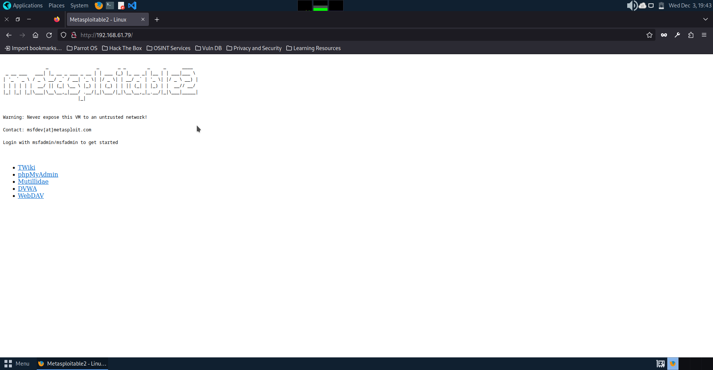
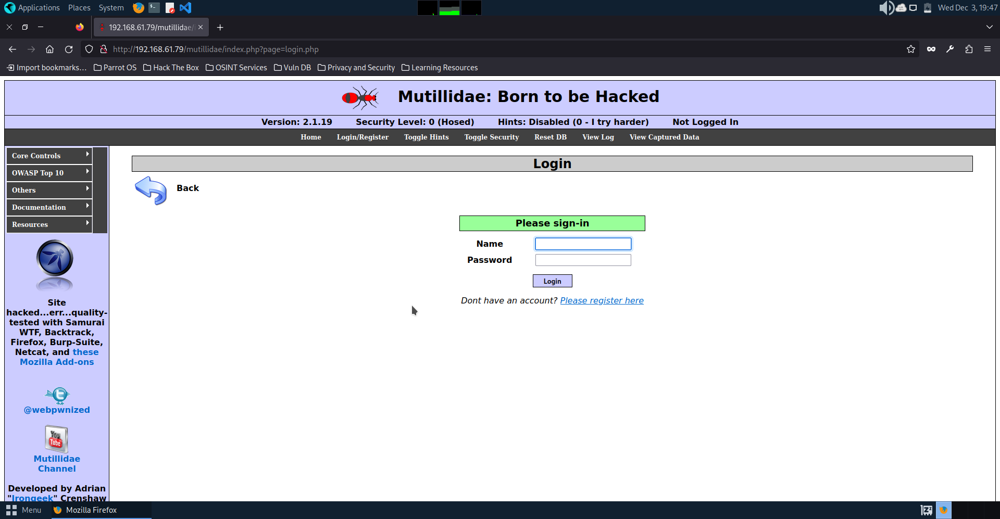
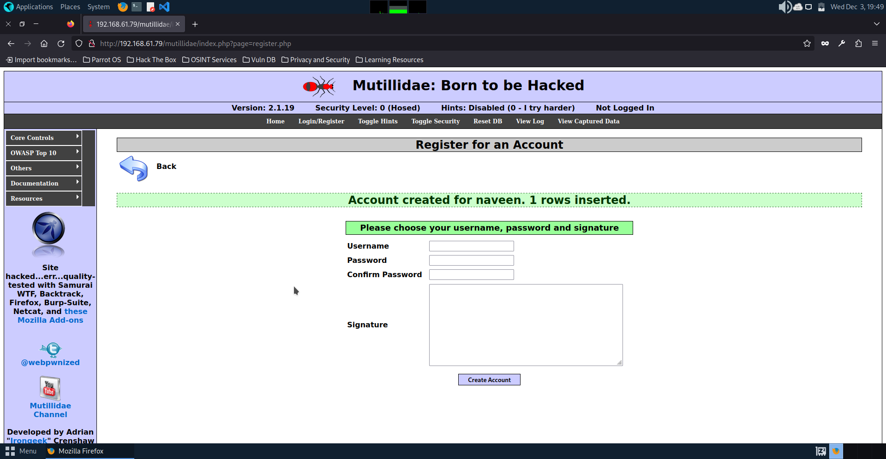
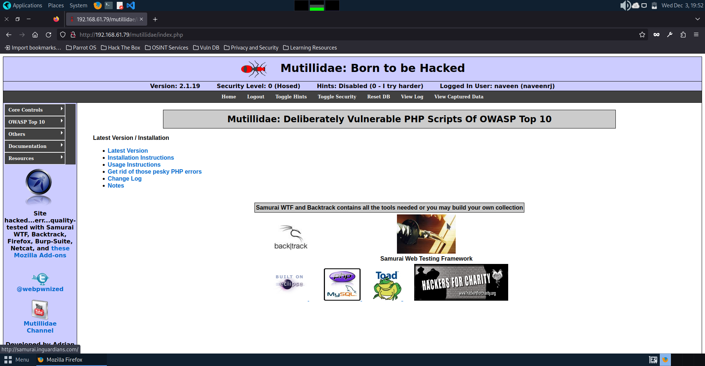
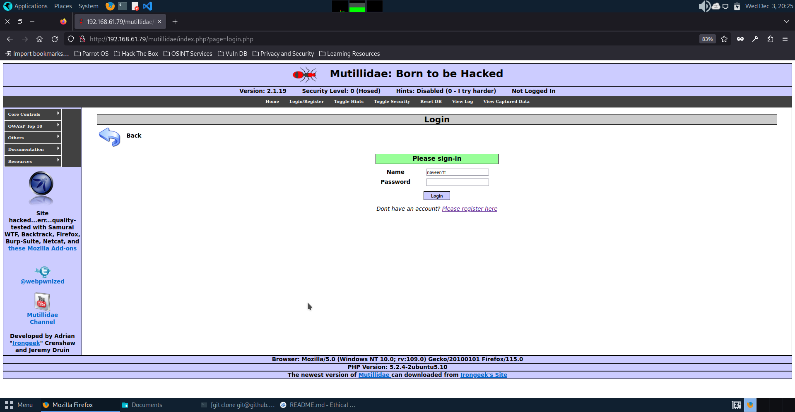
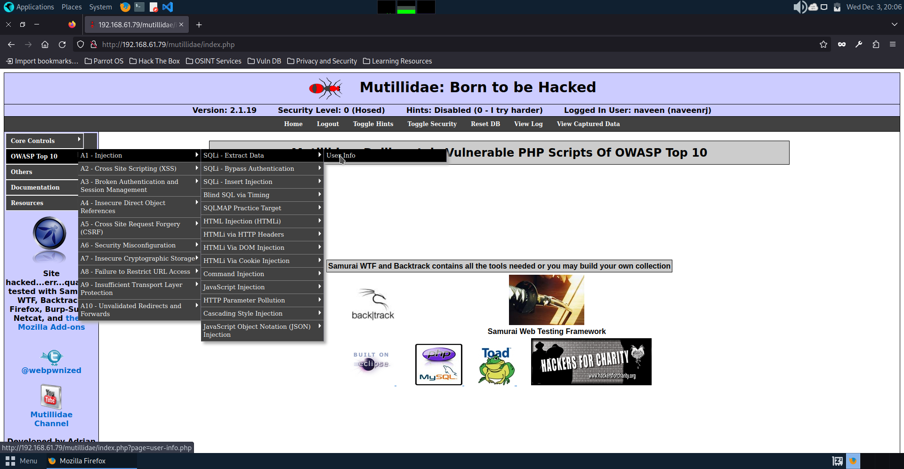
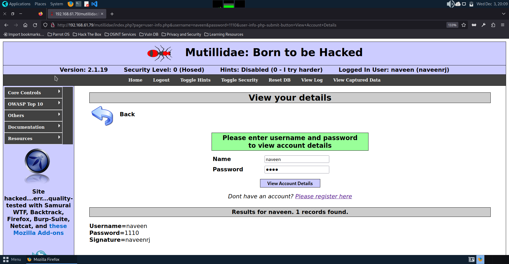

# sqlinjection
Exploiting SQL Injection vulnerability

# AIM:
To exploit SQL Injection vulnerability using Multidae web application in Metasploitable2

## DESIGN STEPS:

### Step 1:

Install kali linux either in partition or virtual box or in live mode

### Step 2:

Investigate on the various categories of tools as follows:

### Step 3:

Open terminal and try execute some kali linux commands

## EXECUTION STEPS AND ITS OUTPUT:

SQL Injection is a sort of infusion assault that makes it conceivable to execute malicious SQL statements. These statements control a database server behind a web application. Assailants can utilize SQL Injection vulnerabilities to sidestep application safety efforts. They can circumvent authentication and authorization of a page or web application and recover the content of the whole SQL database. 
Identify IP address using ifconfig in Metasploitable2
# OUTPUT

Use the above ip address to access the apache webserver of Metasploitable2 from kali/parrot linux. In Kali Linux use the ip address in a web browser.
##  OUTPUT

Select Multidae from the menu listed as shown above. The page is displayed as below:
##  OUTPUT

Click on the menu Login/Register and register for an account
##  OUTPUT

Click on the link “Please register here”
##  OUTPUT

Click on “Create Account” to display the following page:
##  OUTPUT

The login structure we will use in our examples is straightforward. It contains two input fields (username and password), which are both vulnerable. The back-end content creates a query to approve the username and secret key given by the client. Here is an outline of the page rationale:

($query = “SELECT * FROM users WHERE username=’$_POST[username]’ AND password=’$_POST[password]’“;).
 For the username put “ganesh” or “anything” and for the password put (anything’ or ‘1’=’1) or (admin’ or ‘1’=’1) then try to log in, and you’ll be presented with an admin login page.
##  OUTPUT

Click “Login”. The logged in page will show as below:
##  OUTPUT

If error faced in registration follow the following steps in metasploitable 2:

This issue is caused by a misconfiguration in the config.inc located in the /var/www/mutillidae folder on Metasploitable 2 VM.

Edit config.inc
Edit config.inc file located in /var/www/mutillidae folder on Metasploitable 2 by typing the following commands [one at the time]:
cd /
sudo nano /var/www/mutillidae/config.inc
Type msfadmin when prompted for the root password. 
Once nano opens config.inc file, look for the line $dbname = ‘metasploit’ as shown in Figure  below:
##  OUTPUT

Replace ‘metasploit’ with ‘owasp10’ and make sure the lines end with semicolon ; as shown in Figure
##  OUTPUT

Save and exit the config.inc
Save than exit the config.inc file by typing CTRL+X keys on your keyboard and the Y [Enter] when prompted to save the file
Restart the Apache server
To restart Apache, type the following command in the terminal. Alternatively, you can just reboot Metasploitalbe 2 VM.
sudo /etc/init.d/apache2 reload
##  OUTPUT

# Reset Mutillidae database
Refresh the page then clicking on the Reset DB menu option to reset the Mutillidae database [Figure ]. Click OK when prompted.
##  OUTPUT

# Test the new configuration
Alright. Now is time to test if we managed to fix the database issue. Go ahead and register a new account on the Mutillidae webpage.

 The Mutillidae database error no longer appears 
# OUTPUT

Now after logging out you will see the login page. In the login page give ganesh’ # (myusername). You can see the page now enters into the administrator page as before when giving the password.
# OUTPUT

Click the login button and you will see it enter into the administrator page.
# OUTPUT

## Union-based SQL injection

UNION-based SQL injection assaults enable the analyzer to extract data from the database effectively. Since the “UNION” operator must be utilized if the two inquiries have precisely the same structure, the attacker must craft a “SELECT” statement like the first inquiry. 
we will be using the “User Info” page from Mutillidae to perform a Union-Based SQL injection attack. Go to “OWASP Top 10/A1 — Injection/SQLi — Extract-Data/User Info” 

After logging out, Now choose the menu as shown below:
##  OUTPUT

From this point, all our attack vectors will be performed in the URL section of the page using the Union-Based technique.There are two different ways to discover how many columns are selected by the original query. The first is to infuse an “ORDER BY” statement indicating a column number. Given the column number specified is higher than the number of columns in the “SELECT” statement, an error will be returned.
##  OUTPUT

Since we do not know the number of columns, we start at 1. To find the exact amount of columns, the number is incremented until an error related to the “ORDER BY” clause is returned. In this example, we incremented it to 6 and received an error message, so it means that the number of columns is lower than 6.

The browser url of this info page need to be modified with the url as below:
##  OUTPUT

After adding the order by 6 into the existing url , the following error statement will be obtained:
##  OUTPUT

When we ordered by 5, it worked and displayed some information. It means there are five columns that we can work with. Following screenshot shows that the url modified to have statement added with ordered by 5 replacing 6.
# OUTPUT

 As it is having 5 columns the query worked fine and it provides the correct result
##  OUTPUT

Instead of using the "order by" option, let’s use the "union select" option and provide all five columns. Ex: (union select 1,2,3,4,5).
##  OUTPUT

As given in the screenshot below columns 2,3,4 are usable in which we can substitute any sql commands to extract necessary information.
##  OUTPUT

Now we will substitute some few commands like database(), user(), version() to obtain the information regarding the database name, username and version of the database.
##  OUTPUT

The url when executed, we obtain the necessary information about the database name owasp10, username as root@localhost and version as 5.0.51a-3ubuntu5.
In MySQL, the table “information_schema.tables” contains all the metadata identified with table items. Below is listed the most useful information on this table.

Replace the query in the url with the following one:
union select 1,table_name,null,null,5 from information_schema.tables where table_schema = ‘owasp10’
##  OUTPUT

The url once executed will  retrieve table names from the “owasp 10” database.
##Extracting sensitive data such as passwords 

When the attacker knows table names, he needs to discover what the column names are to extract data.

In MySQL, the table “information_schema.columns” gives data about columns in tables. One of the most useful columns to extract is called “column_name.”

Ex: (union select 1,colunm_name,null,null,5 from information_schema.columns where table_name = ‘accounts’).

Here we are trying to extract column names from the “accounts” table.
##  OUTPUT

The column names of the accounts is displayed below for the following url:

Once we discovered all available column names, we can extract information from them by just adding those column names in our query sentence.

Ex: (union select 1,username,password,is_admin,5 from accounts).
##  OUTPUT

## Reading and writing files on the web-server
We can use the “LOAD_FILE()” operator to peruse the contents of any file contained within the web-server. We will typically check for the “/etc/password” file to see if we get lucky and scoop usernames and passwords to possible use in brute force attacks later.

Ex: (union select null,load_file(‘/etc/passwd’),null,null,null).

##  OUTPUT

## RESULT:
The SQL Injection vulnerability is successfully exploited using the Multidae web application in Metasploitable2.
